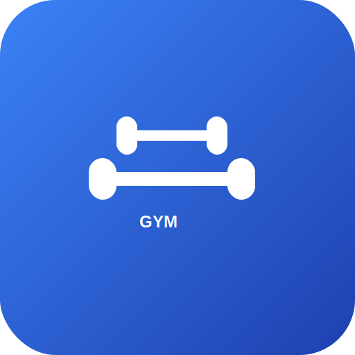

# GymTrack - Complete Gym Management System



A comprehensive, modern gym management system built with Laravel 12, featuring Progressive Web App (PWA) support, complete member management, trainer scheduling, payment tracking, and attendance monitoring.

## 🚀 Features

### Core Management
- **Member Management**: Complete member profiles with photo upload, medical information, and emergency contacts
- **Trainer Management**: Trainer profiles with specializations, schedules, and member assignments
- **Branch Management**: Multi-branch support with individual managers and settings
- **Package Management**: Flexible membership packages with pricing and duration options

### Advanced Features
- **Payment Tracking**: Comprehensive payment management with multiple payment methods
- **Attendance Monitoring**: Real-time attendance tracking with statistics and reports
- **Workout Routines**: Custom workout plans and exercise tracking
- **Role-Based Access Control**: Admin, Branch Manager, Trainer, and Receptionist roles
- **PWA Support**: Install as a mobile app with offline capabilities

### Business Features
- **Dashboard Analytics**: Comprehensive statistics and reporting
- **Backup System**: Automated database backups with download functionality
- **Gallery Management**: Photo gallery for gym events and activities
- **Notice Board**: Internal communication system
- **Inquiry Management**: Customer inquiry tracking and response system

## 🛠️ Technical Specifications

- **Framework**: Laravel 12 (PHP 8.2+)
- **Frontend**: Tailwind CSS, Alpine.js, Chart.js
- **Database**: MySQL/MariaDB
- **PWA**: Service Worker, Web App Manifest
- **File Upload**: Image processing with Intervention Image
- **PDF Generation**: Laravel DomPDF for reports
- **Excel Export**: Maatwebsite Excel for data export
- **Permissions**: Spatie Laravel Permission package

## 📋 Requirements

- PHP 8.2 or higher
- MySQL 5.7+ or MariaDB 10.3+
- Composer
- Node.js & NPM
- Web server (Apache/Nginx)

## 🚀 Installation

### Quick Installation

1. **Upload Files**: Upload all files to your web server
2. **Set Permissions**: Ensure `storage/` and `bootstrap/cache/` are writable
3. **Run Installation**: Visit your domain to start the installation wizard
4. **Follow Setup**: Complete the database configuration and admin account creation
5. **Access Admin**: Login with your admin credentials

### Manual Installation

1. **Install Dependencies**:
   ```bash
   composer install
   npm install
   ```

2. **Environment Setup**:
   ```bash
   cp .env.example .env
   php artisan key:generate
   ```

3. **Database Setup**:
   ```bash
   php artisan migrate --seed
   ```

4. **Build Assets**:
   ```bash
   npm run build
   ```

5. **Storage Link**:
   ```bash
   php artisan storage:link
   ```

## 🎯 Default Login Credentials

After installation, use these credentials to login:

- **Admin**: admin@gymtrack.com / password
- **Branch Manager**: manager@gymtrack.com / password
- **Trainer**: trainer@gymtrack.com / password

## 📱 PWA Features

- **Installable**: Add to home screen on mobile devices
- **Offline Support**: Basic functionality works offline
- **Push Notifications**: Real-time updates (configurable)
- **App-like Experience**: Native app feel in browser

## 🔧 Configuration

### PWA Settings
Access PWA settings from Admin Panel → Settings → PWA Settings to customize:
- App name and description
- Theme colors
- Icons and splash screens
- Installation behavior

### Email Configuration
Configure SMTP settings in `.env` file for email notifications:
```env
MAIL_MAILER=smtp
MAIL_HOST=your-smtp-host
MAIL_PORT=587
MAIL_USERNAME=your-email
MAIL_PASSWORD=your-password
MAIL_ENCRYPTION=tls
```

## 📊 Sample Data

The system includes comprehensive sample data:
- 4 Branches with managers
- 20 Trainers across branches
- 92 Members with profiles
- 225 Workout Routines
- 417 Payment Records
- 1791 Attendance Records

## 🔒 Security Features

- **CSRF Protection**: All forms protected against CSRF attacks
- **SQL Injection Prevention**: Eloquent ORM with parameterized queries
- **XSS Protection**: Input sanitization and output escaping
- **Role-Based Access**: Granular permission system
- **Secure File Upload**: File type and size validation
- **Password Hashing**: Bcrypt password hashing

## 📈 Performance Optimizations

- **Query Optimization**: Efficient database queries with proper indexing
- **Caching**: Laravel caching for improved performance
- **Asset Optimization**: Minified CSS and JavaScript
- **Image Optimization**: Automatic image resizing and compression
- **Pagination**: Efficient data pagination for large datasets

## 🎨 Customization

### Themes
- Easily customizable with Tailwind CSS
- Responsive design for all devices
- Dark/Light mode support (configurable)

### Branding
- Upload custom logos and favicons
- Customize app name and colors
- PWA manifest customization

## 📞 Support

For technical support and customization requests:
- **Documentation**: Complete installation and user guides included
- **Code Quality**: Clean, well-documented code following Laravel best practices
- **Updates**: Regular updates and bug fixes

## 📄 License

This is a commercial product. Please ensure you have a valid license before use.

## 🔄 Updates

Regular updates include:
- Security patches
- New features
- Performance improvements
- Bug fixes

## 📋 Changelog

### Version 1.0.0
- Initial release
- Complete gym management system
- PWA support
- Multi-branch management
- Comprehensive reporting
- Mobile-responsive design

---

**GymTrack** - The complete solution for modern gym management. Built with ❤️ using Laravel.